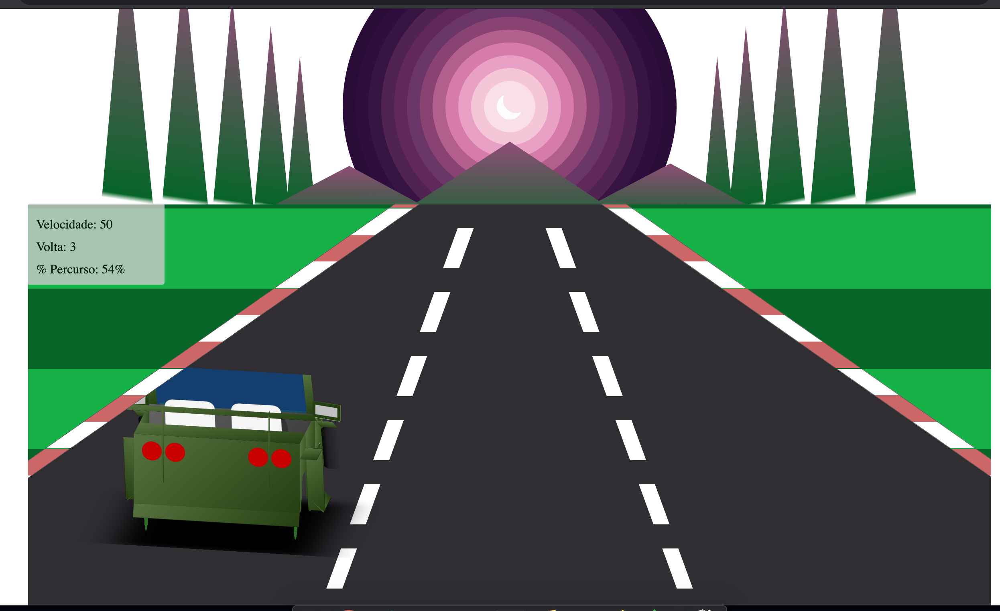
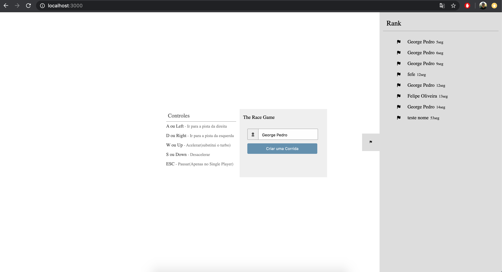
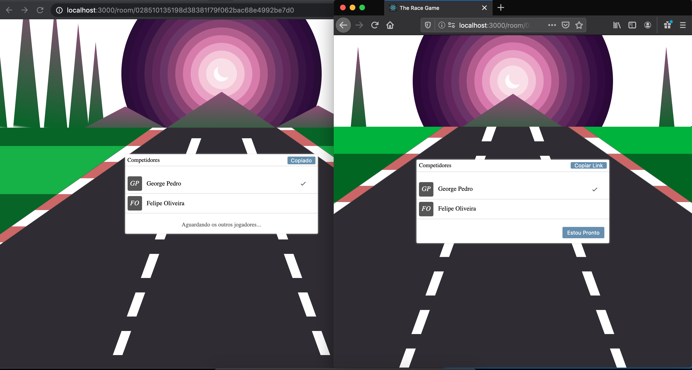
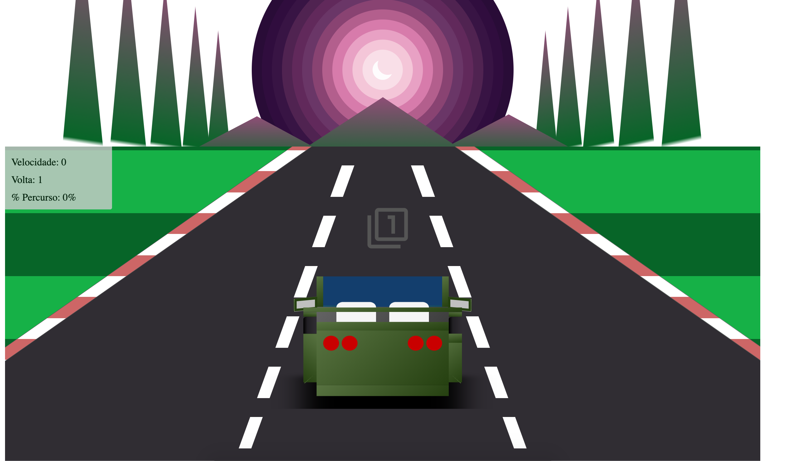
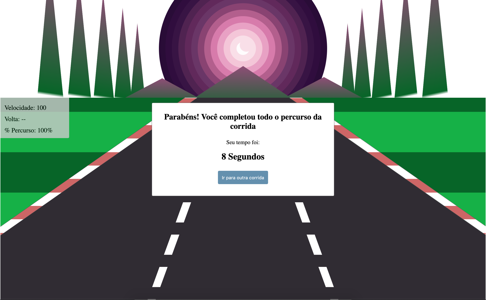

# Race Game

É um jogo de corrida multiplayer que esta em desenvolvimento, ele se divide basicamente em 2 telas

* Home Page
    - Onde é possivel cadastrar seu nickname
    - Ver informaçōes sobre os controler
    - Leader Board (Rank)
* Pagina de Corrida
    - Copiar o link e passar pra outras pessoas, para que elas possam se conectar a sala e jogar no modo multiplayer
    - Iniciar, terminar e jogar a corridar

### Tecnologias Utilizadas

As tecs usadas foram:

* [ReactJS] - Para interatividade com as telas e estrutura
* [CSS] - Design do projeto
* [GraphQL] - Ligar o front-end com o back-end
* [NodeJS] - Back-end
* [MongoDB] - Banco de dados utilizado
* [Socket.io] - Conecta o usuario ao WebSocket em uma sala

### Funcionalidades/Desenvolvido

* Ao abrir o jogo, deve aparecer um formulário contendo o campo Nome e um botão Iniciar Corrida. ( Cria uma sala na qual mais de um jogador pode se conectar)
* Um contador deve aparecer (3, 2, 1...). Após isso, o carro passará a se movimentar na pista. 
* O carro poderá alternar entre três lados da pista (esquerda, meio e direita). Podemos usar as teclas A (esquerda), S (meio), D (direita) para alternar a posição do carro. Além disso, também deve ser possível alternar a posição para esquerda ou direita usando as setinhas do teclado. 
* Estar disponível em um repositório público ou privado usando alguma ferramenta de controle de versão de código, como Github, Gitlab ou BitBucket.
* Ser compatível com as versões mais recentes do Chrome e Firefox.
* Criar o modo nitro, adaptei para o acelerar e freiar...
* Número de Voltas, nao apenas o numero de volta mas o % de progresso na corrida e um velocimetro.
* Apenas CSS, nao possuúi nenhuma imagem, somente HTML, CSS e JavaScript.
* Link Público, ao acessar uma sala de corrida, tem um botao "copiar link", ao clicar nele e outro usuario acessar o link, ele se conecta a mesma sala.
* Fim de Corrida, "não é divertido ficar correndo em círculos infinitamente", apos terminar o percurso, adiciona o tempo a leaderboard e tambem apresenta os resultados da corrida ao usuario.
* Leaderboard, armazena o tempo que cada jogador levou para finalizar a corrida numa leaderboard, claro, desenvolvido com uma api via GraphQL.
* MEIO CHECK - levei em consideracao as tecs do projeto mas usei de uma forma moderada, usando o meu estilo de desenvolvimento tambem, posso programar de outras formas, apenas prefiro pra projetos pessoais, prefiro usa-las dessa forma:
	- Usei React, sei usar Hooks... mas nao usei hook, prefeiri nao usar classes(e tem um debate se uma tela e uma classe... mas pra projetos pessoais, eu gosto mais) 		Basicamente: const [variavel, funcaoQueMudaOStateDela] = useState(VALOR_INICIAL);
	- GraphQL usei para querys e mutations, na qual salvo o rank, para WebSocket preferi usar o Socket.io, pois nao tenho familiaridade com o subscription.
	- Sobre StyledComponents, usei ele, gostei dele e conheci ele a partir desse projeto.
*  Fazer a documentacao no codigo e no repositorio - Documentação → uma descrição detalhada contando mais sobre o jogo.
*  Readme no repositorio com explicaçaão de como instalar e rodar a aplicacao

### Pendentes/A Desenvolver

* Multiplayer, esta funcionando em partes, ja tem a sala, varios usuarios se conectam a ela, estao ligados mas ao comecar a corrida, aparece apenas 1 carro, é algo para ajustar.
* Obstáculos, colocar uma pedra ou outro obstaculo na pista.
* Pause ao clicar no ESC.
* CSS pra alterar pra mobile com @media screen (media query) e adicionar os evento swipe left|top|right|bottom para dirigir o carro.
* Testes Unitários, desenvolvi em 2 dias correndo, nao fiz um teste unitário ainda mas vou adicionar alguns após terminar o multiplayer e os obstaculos. ( Testes unitarios tanto pro front-end quanto pro back-end )

### Video Preview

Clique na imagem para abrir no youtube

[](https://www.youtube.com/watch?v=ngOzsTt5mAw)


### Dependencias

| Dependencias | Links |
| ------ | ------ |
| NodeJS & NPM | https://nodejs.org/en/download/ |
| MongoDB | https://www.mongodb.com/download-center |

### Configurando a Aplicação

1 - Clone o repositorio atual para sua area de trabalho:
```sh
$ git clone https://github.com/felipewget/race-game
```

2- Haverá 2 pastas no projeto, "client" e "server", na qual, há arquivos para serem configurados:
* server
    *  Renomeie o arquivo "env.env" para apenas .env, ali tem configuracoes de portas do GraphQL server, do Socket.io Server e tambem o nome db que vamos trabalhar
    *  em: config/dbConnect.js, devemos adicionar os dados de conexao com o banco MONGODB
    *  Já podemos startar o banco MongoDB
* client - Aplicacao em React
    *  Client não há arquivos para serem configurados mas, acho interessante comentar sobre o arquivo "constants.js" que contei as rotas do backend

3- Instalando Dependencias do Projeto:
* Entre na pasta "server" e execute o comando abaixo:
    ```sh
    $ npm install
    ```

* Entre na pasta "client" e execute o comando abaixo:
    ```sh
    $ npm install
    ```

### Startando a Aplicação

Executar a aplicação, é simples, basta:
* Entrar na pasta "server" e execute o comando abaixo:
    ```sh
    $ node app
    ```

* Entre na pasta "client" e execute o comando abaixo:
    ```sh
    $ yarn start
    ```

### Executando Testes Unitaários

## @TODO


### Galeria







License
----

MIT


**Let`s Code! Hell Yeah!**